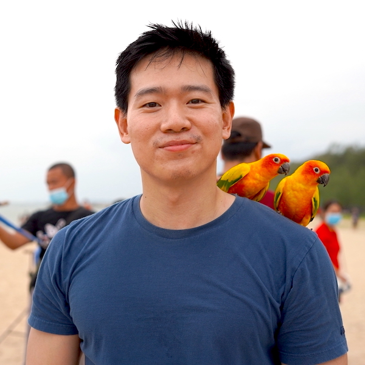

Chainarong Tangsurakit
======

*Remark: This resume was generated using [GitHub Action CI/CD](https://github.com/chaintng/my-resume)*

A software engineer who like cracking problem in a logical and creative way.

**Key Characteristic:** Ownership - Commitment - Skeptical - Curiosity - Self-motivated.

###### [ [chaintng.com](https://chaintng.com) ] . [ chaintng@gmail.com ] . [ +66 89 4433 297 ]

Skills
--------
#### DevOps
- Responsibility for implement full CI/CD pipeline of multiple services (Build, Test, Release).
- Introduce infrastructure-as-Code to team (Terraform, Ansible, Dockerfile, GitHub/GitLab CI).
- Strong knowledge on Developer & Operation Tools including Grafana, Kubernetes, CDN, ElasticSearch, Hadoop, Linux command etc.
- Strong experience with Amazon Web Services, Google Cloud Platform.

#### Javascript / node.js
- Building up new microservices using node.js to serve global-scale users, fast and support high concurrency. Deliver work with automated test (Unit, Contract, System Test, Load Test).
- Building React website, and its automated UI test including Cypress, Selenium and Playwright.

#### Database
- Deep understanding in SQL Query and Store Procedure (MySQL, Postgres, PostGIS).
- Database tuning: indexing, query optimization, restructuring.

Experience
---------
**Staff Software Engineer, Agoda Services Co., Ltd.** (2018 - Present)

- Migrating old mobile website to new technology (Microservices, Single-page application).
- Migrating code base to new GIT provider and new CI/CD tools.
- Develop new feature in hotel booking system, both frontend and backend sub-services, with automated test (UI, API, Contract testing) (Langauge: C#, Javascript, Python, Scala).

**Software Engineer, LINE Company (Thailand) Limited** (2017 - 2018)

- Migrate high traffic live applications in less to zero downtime.
- Investigate and improve current monolithic applications to support higher concurrency.
- Working with Rancher stacks to ease application deployment process.

**Senior Developer, HotelQuickly** (2015 - 2017)

- Live migrating systems from Amazon Web Service (AWS) to Google Cloud Platform (GCP).
- Introduce continuous integration and ensure development cycle is as fast as possible.
- Ensure high system reliability by utilizing tools for monitoring, tracing and alerting.

Education
---------
**KMUTT, TH — Master Degree** (2014): Software Technology, School of Information Technology 
